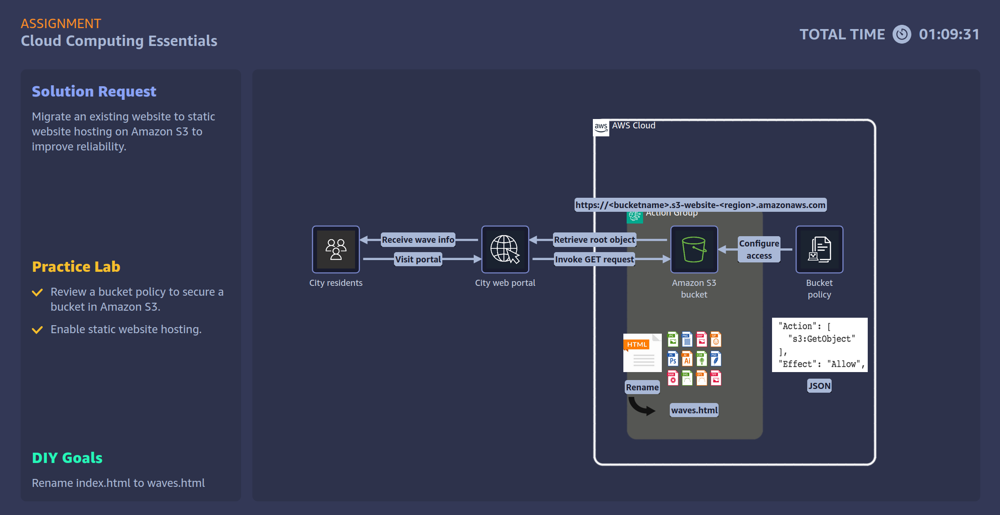

# Lab 01: Cloud Computing Essentials

## Problem Statement

**Jack Mayers – City Mayor**

I'm managing our city's web portal team and facing challenges with our beach wave size prediction webpage. Our current system isn't reliable enough for residents who depend on this information for safe beach activities. We need a reliable, scalable hosting solution that can store daily prediction files, an HTML file for displaying data in tables, plus JavaScript and CSS files – all relatively small in size – and perform consistently even during high traffic periods.

## Solution Approach

To solve the problem, the city’s web portal was migrated to a **newly created Amazon S3 bucket** configured for **static website hosting**:

1. **S3 Bucket Creation:**  
   - A dedicated S3 bucket was created to host the webpage and store daily prediction files.  
   - The HTML file, JavaScript, CSS, and data files were uploaded to the bucket.

2. **Access Control and Security:**  
   - Bucket policies were configured to allow public read access (`s3:GetObject`) for the HTML webpage.  
   - IAM roles with least privilege were set up for administrative access to upload or modify files.  
   - Server-side encryption (SSE-S3) was enabled to secure data at rest.

3. **Architecture Diagram:**  
     
   

4. **Outcome:**  
   - The webpage now scales automatically to handle traffic spikes.  
   - Daily prediction files are reliably stored, and access controls prevent unauthorized changes.  
   - The site is highly available (99.99%) and serves the public safely and consistently.

**AWS Services Used:** S3 encryption + bucket policies, IAM roles & least privilege  

---

## ISO 27001:2022 Control–Risk Mapping (Using Only Services in Diagram)

| ISO 27001 Control | Risk Mitigated in the Scenario | AWS Feature from Diagram |
|------------------|--------------------------------|-------------------------|
| A.5.15 – Access control | Unauthorized upload or change of prediction files causing misinformation. Accidental file deletion causing loss of availability. Public write access risk. | S3 bucket policy to allow only `s3:GetObject` for public, IAM access for authorized staff. |
| A.5.29 – Information security in supplier relationships | Misunderstanding of AWS’s shared responsibility model leading to misconfiguration. Failure to secure data in AWS S3 causing service trust issues. | AWS S3 service with correctly configured access controls per shared responsibility guidance. |
| A.8.3 – Information classification and handling | Integrity loss of critical public safety data. Inability to trace file changes for accountability. Public access to unprotected or corrupted files. | Amazon S3 with server-side encryption (SSE-S3) and versioning enabled. |
| A.5.30 – ICT readiness for business continuity (Suggested addition) | Website downtime during peak traffic season if storage can’t scale. Delays in residents receiving safety-critical wave data. No rapid recovery if storage fails. | Amazon S3 provides high availability (99.99%) and scales automatically to meet traffic demand. |

---

## Evidence & Files

- Screenshot(s) in `evidence/lab01/`  
- Architecture diagram above shows the S3 bucket as the web portal source

---

## Lessons Learned & Notes

### S3 for Static Website Hosting
- Amazon S3 can host static websites (HTML, CSS, JS, data files) with high reliability.  
- Server-side encryption (SSE) is available by default but must be configured by the bucket owner to meet security requirements.

### Importance of the Shared Responsibility Model
- AWS manages the physical infrastructure, but the organization remains responsible for:
  - Configuring SSE correctly  
  - Managing access controls and bucket policies  
  - Ensuring compliance with applicable regulations  
- Compliance is achieved through proper configuration, not automatically applied.

### Risk Mitigation via Access Policies
- Correctly implemented S3 bucket policies mitigate risks such as:  
  - Unauthorized access  
  - Accidental or malicious modification/deletion of files  
- Access controls are a direct implementation of ISO 27001 Annex A.5.15 (Access Control).

### High Availability & Business Continuity
- S3 offers built-in high availability (99.99%) and automatic scaling to handle variable or seasonal demand.  
- This reduces the risk of downtime during peak usage periods, supporting business continuity.  
- Some AWS services, like S3, come with embedded risk mitigation features (availability, scalability) by default.
