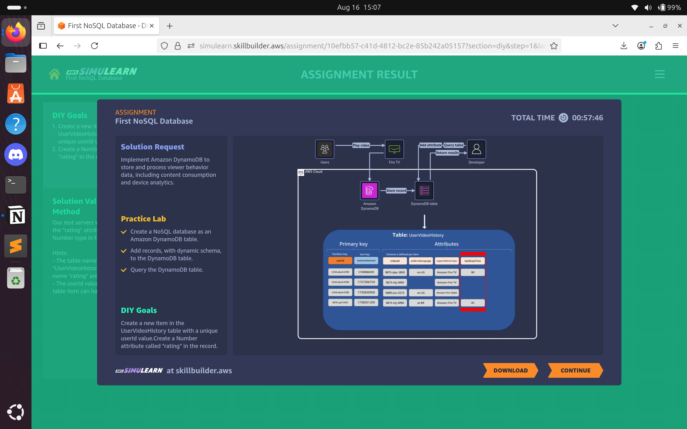

# Lab 04: NoSQL Database

## Problem Statement

**Grace Null - Database Administrator** 

I'm managing a streaming entertainment company and we're struggling to collect and manage viewer behavior data. Our current system can't handle the massive amounts of user interaction data we receive. I need help finding a database that provides consistent performance at any scale with a flexible schema for different attributes. It needs to be serverless with no infrastructure to manage, able to scale automatically with traffic growth, and consistently deliver responses within milliseconds. We're willing to restructure our data and have our developers learn NoSQL if needed. Can you recommend a solution that would work for us?

## Solution Approach

To address the problem, we implemented **Amazon DynamoDB**, a serverless NoSQL database, with optional integration to **AWS Lambda** and **Amazon CloudFront** for edge-accelerated content delivery:

1. **DynamoDB for Scalable NoSQL Storage:**  
   - Provides **consistent performance** at any scale with a flexible schema to handle diverse attributes.  
   - Fully **serverless** with automatic scaling based on traffic and request load.  
   - Low-latency responses ensure a **smooth user experience** even under high load.  

2. **Architecture Diagram**  
     

3. **Outcome:**  
   - Reliable collection and management of **viewer behavior data**.  
   - Scales automatically to accommodate **growing traffic** and data volume.  
   - Serverless architecture reduces **operational overhead**.  
   - Supports restructuring of data as needed for future analytics and insights.  

**AWS Services Used:** AWS DynamoDB.  

---

## ISO 27001:2022 Control–Risk Mapping (Using Only Services in Solution)

| ISO 27001 Control | Risk Mitigated in the Scenario | AWS Feature from Solution |
|------------------|--------------------------------|---------------------------|
| A.8.3 – Protection of records | Unauthorized access or tampering with user behavior data | DynamoDB encryption (at rest & in transit) |
| A.5.29 – Access control for information systems | Unauthorized execution of operations on the database | IAM roles and DynamoDB permissions enforce proper access |
| A.5.3 – Governance of information security | Mismanagement of database scaling or schema changes | DynamoDB provides managed scaling and operational governance |
| A.5.3 – Governance of information security | Lack of standardized processes for database management | AWS management tools ensure operational policies are followed |

---

## Evidence & Files

- Screenshot(s) in `evidence/lab04/` showing:  
- DynamoDB tables and schemas  
- Architecture diagram showing DynamoDB.

---

## Lessons Learned & Notes

### Understand AWS Shared Responsibility Model
- Clearly define what AWS manages versus what the organization is responsible for, including **data security, backups, and operational tasks**.  

### Select Solutions Aligned with Business Needs
- Choosing **DynamoDB** ensures scalable, low-latency storage that automatically adjusts to traffic growth.  

### Ensure High Availability and Consistency
- Implement **data replication** across availability zones to prevent downtime and handle peak traffic efficiently.  

### Define Roles and Access Clearly
- Assign **IAM roles** and permissions to control who can access and manage sensitive data.  

### Manage Assets and Sensitive Data Properly
- Maintain an **inventory of databases and scripts**, implement backups, and encrypt sensitive information to ensure security and compliance.  

---

## Future Improvements

1. **Implement Automated Backups and Point-in-Time Recovery**
   - Enable **DynamoDB PITR** to allow restoration of data in case of accidental deletion or corruption.  

2. **Integrate Monitoring and Alerts**
   - Use **Amazon CloudWatch** to monitor table metrics, read/write capacity, and latency.  
   - Configure alerts to detect performance bottlenecks or unusual activity.  

3. **Leverage Global Tables for Multi-Region Availability**
   - Deploy **DynamoDB Global Tables** to replicate data across regions.  
   - Ensures **low-latency access** for international users and improves disaster recovery capabilities.  
