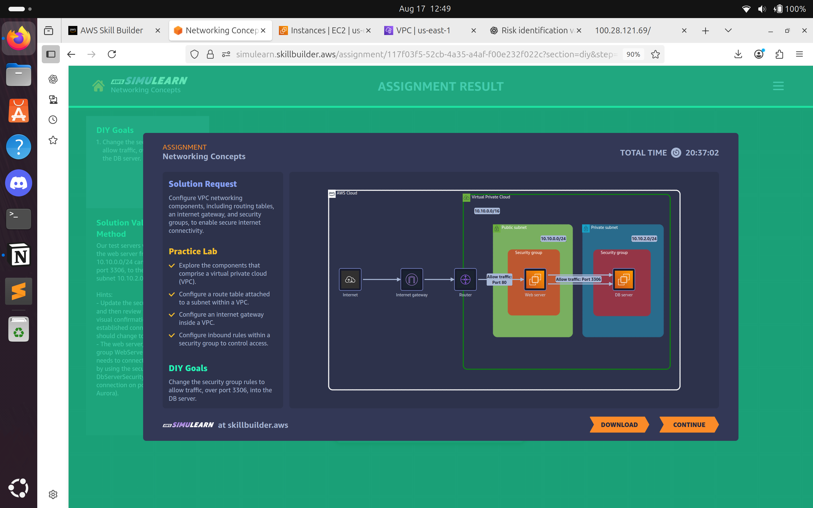

# Lab 05: Networking Concepts

## Problem Statement

**Pixel Monagher – Network Administrator**  

I'm concerned about establishing secure network communication between our bank's internal resources and the internet. We handle sensitive financial data that must be protected while still allowing necessary internet connectivity. I need a component that allows communication between our VPC and the internet, supports both IPv4 and IPv6, and won't create availability risks. It should let resources in public subnets connect to the internet if they have public IP addresses, while also allowing internet resources to connect to our public-facing systems. Could you help me set up this kind of internet connectivity solution that includes proper routing and network address translation capabilities?

## Solution Approach

To address the problem, we implemented an **Internet Gateway (IGW)** attached to the VPC with proper routing and access controls:  

1. **Internet Gateway for Public Internet Connectivity:**  
   - Allows resources in public subnets with **public IP addresses** to initiate outbound connections.  
   - Enables inbound internet traffic to reach **public-facing resources**.  
   - Supports both **IPv4 and IPv6** for global connectivity.  

2. **Routing and Security Controls:**  
   - Configured a **route table** to direct internet-bound traffic to the IGW.  
   - Applied **security groups** with least-privilege inbound rules to control access.  
   - Ensured separation between public and private subnets for secure segmentation.  

3. **Architecture Diagram**  
     

4. **Outcome:**  
   - Secure, controlled connectivity between the VPC and the internet.  
   - High availability through AWS-managed IGW infrastructure.  
   - Reduced risk of misconfiguration by applying proper routing and access policies.  

**AWS Services Used:** VPC, Internet Gateway, Route Tables, Security Groups.  

---

## ISO 27001:2022 Control–Risk Mapping (Using Only Services in Solution)

| ISO 27001 Control | Risk Mitigated in the Scenario | AWS Feature from Solution |
|------------------|--------------------------------|---------------------------|
| A.8.9 – Configuration management | Misconfigured routing or security groups exposing resources | AWS Config monitors route tables and SGs |
| A.8.21 – Security of network services | Lack of segmentation or insecure network exposure | VPC Subnets, Security Groups, NACLs |
| A.8.22 – Secure network architecture | Uncontrolled internet access paths to systems | VPC design with IGW and route tables |
| A.5.15 – Access control | Unauthorized access to public-facing resources | Security Groups and IAM policies |
| A.5.18 – Protection of PII | Unauthorized access or leakage of sensitive data | IAM, Encryption, Security Groups |
| A.8.3 – Information transfer | Data interception or manipulation during transit | TLS encryption in transit |
| A.8.12 – Capacity management | Availability risks under heavy traffic | Scalable IGW infrastructure |
| A.8.14 – Redundancy of information processing facilities | Unavailability of services due to single-point failure | Multi-AZ VPC setup with AWS-managed redundancy |
| A.5.33 – Information security in supplier relationships | Misunderstanding AWS vs. customer responsibility | AWS Shared Responsibility Model |

---

## Evidence & Files

- Screenshot(s) in `evidence/lab05/` showing:  
- VPC with attached Internet Gateway.  
- Route table with 0.0.0.0/0 and ::/0 entries.  
- Security group inbound rules configuration.  
- Architecture diagram showing IGW setup.  

---

## Lessons Learned & Notes

### Understand AWS Shared Responsibility Model
- AWS manages IGW availability, while the bank is responsible for **routing, subnet design, and access control configuration**.  

### Ensure Availability and Resilience
- Redundant VPC design ensures **uptime for client-facing systems**.  
- Downtime risks should always be reviewed in design.  

### Manage Security Groups and Segmentation Properly
- **Correct configuration of SGs** is critical to avoid unauthorized access.  
- **Network segmentation** (public vs. private subnets) reduces attack surface.  

### Protect Critical Assets (PII)
- Restrict and monitor access to sensitive data.  
- Encrypt traffic in transit and enforce IAM restrictions.  

### Perform Regular Configuration Reviews
- Continuous monitoring of **route tables, SGs, and NACLs** is essential to prevent misconfigurations.  

---

## Future Improvements

1. **Enhance Monitoring and Detection**  
   - Enable **VPC Flow Logs** and integrate with **Amazon GuardDuty** for threat detection.  

2. **Automated Compliance Auditing**  
   - Use **AWS Config** rules to enforce correct routing and SG configurations.  

3. **Implement Web Application Firewall (WAF)**  
   - Add **AWS WAF** to protect public-facing applications from common attacks (SQLi, XSS, etc.).  

4. **Stronger Outbound Control**  
   - Implement **NAT Gateway + Egress-only IGW** for private subnets to minimize data exfiltration risks.  
