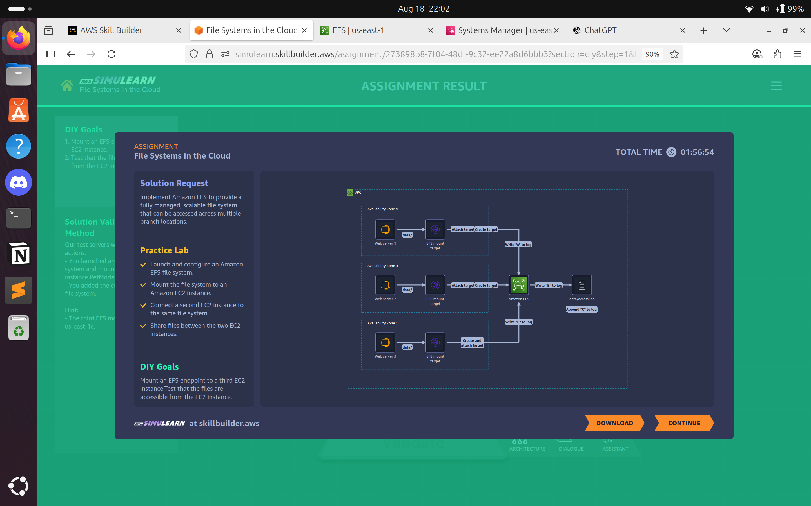

# Lab 07: File Systems in the Cloud 
## Problem Statement  

**Skye LaPoint – Cloud Architect**  

In the past year, we have established three new company branches in the city. Each branch has its own pet image server that connects to a local client management application. Each server stores images of all our pet clients along with informational metadata. We use a custom application to sync the client data across all three branches. But it takes too much time to access the images, and it's not always consistent. Our syncing solution fails sometimes because one branch server might run out of storage space. We need a solution that centralizes our image storage and scales automatically. All branches must access and update the same pet client files. We also have certain folders for our VIP clients that only our concierge team has access to.  

## Solution Approach  

To address the problem, we implemented **Amazon Elastic File System (EFS)** with integration to **Amazon EC2** instances at each branch:  

1. **EFS for Centralized and Scalable File Storage**  
   - Provides a **shared, elastic file system** accessible from multiple branches.  
   - Automatically **scales storage capacity** up and down as files are added or removed.  
   - Ensures **consistent and fast access** to pet images and metadata.  

2. **Access Control and Security**  
   - **IAM policies and POSIX permissions** enforce access rules for VIP client folders.  
   - Data is encrypted **at rest and in transit** to protect sensitive client information.  

3. **Architecture Diagram**  
     

4. **Outcome**  
   - Eliminates inconsistent syncing by using a **single centralized file system**.  
   - Automatically scales to handle new images without risk of storage exhaustion.  
   - Provides **fine-grained access control** for VIP client folders.  
   - Reduces operational overhead by removing the need for custom sync scripts.  

**AWS Services Used:** Amazon EFS, Amazon EC2, AWS IAM.  

---

## ISO 27001:2022 Control–Risk Mapping (Using Only Services in Solution)  

| ISO 27001 Control | Risk Mitigated in the Scenario | AWS Feature from Solution |  
|-------------------|--------------------------------|---------------------------|  
| A.5.15 – Access control | Unauthorized access to VIP client folders | IAM policies and EFS POSIX permissions restrict access |  
| A.8.12 – Data leakage prevention | Risk of exposing sensitive client images | EFS encryption at rest & in transit ensures secure file storage |  
| A.5.23 – Information security in use of cloud services | Mismanagement of scaling or shared storage | EFS automatically scales and integrates securely with EC2 |  
| A.5.34 – Privacy and protection of PII | VIP client image data exposure | Encrypted storage and restricted permissions protect PII |  

---

## Evidence & Files  

- Screenshot(s) in `evidence/lab07/` showing:  
  - EFS file system creation and mount targets.  
  - IAM role/policy enforcing restricted access.  
  - Architecture diagram showing EFS as centralized storage.  

---

## Lessons Learned & Notes  

### Use Elastic Storage for Scalability  
- EFS ensures storage **grows automatically** with business needs, avoiding manual interventions.  

### Apply Principle of Least Privilege  
- VIP folders restricted via IAM roles and POSIX permissions protect sensitive customer data.  

### Ensure High Availability  
- EFS is designed to be highly available across multiple availability zones, reducing downtime risks.  

### Encrypt Sensitive Data  
- Use **EFS encryption** and manage keys with **AWS KMS** to safeguard confidential files.  

### Simplify Operations  
- Centralized storage removes the need for **custom sync scripts**, reducing administrative effort.  

---

## Future Improvements  

1. **Enable Lifecycle Management**  
   - Automatically move infrequently accessed pet images to **EFS Infrequent Access (IA)** to reduce costs.  

2. **Add Monitoring and Alerts**  
   - Use **Amazon CloudWatch** to track storage usage, latency, and access patterns.  
   - Set up alerts for unusual access attempts.  

3. **Integrate Backup Strategy**  
   - Enable **AWS Backup** to automate scheduled backups of the EFS file system.  
   - Supports faster disaster recovery and compliance requirements.  
