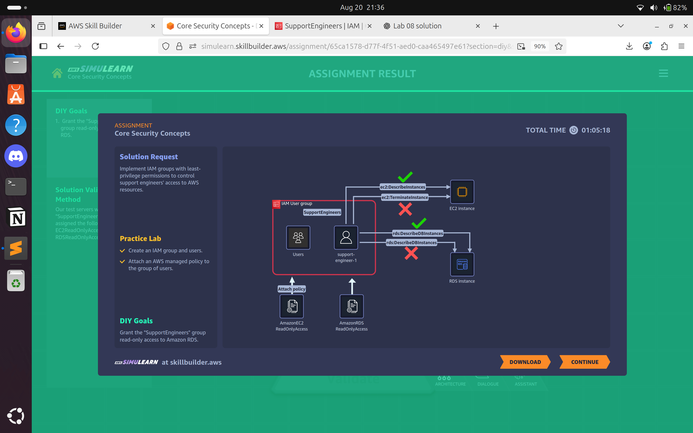

# Lab 09: Core Security Concepts  
## Problem Statement  

**Morgana Key – Security Analyst**  

We have a growing Support Engineering team, and we need to give all team members the same access permissions. Can AWS help us manage this efficiently?  

My support engineers need access to both the AWS Management Console and developer tools. I also want to add them to the Support Engineering team when I create their accounts.  

---

## Solution Approach  

To address the problem, we implemented centralized identity and access management using **AWS IAM**:  

1. **IAM Group for Support Engineers**  
   - Provides a single place to manage access permissions for all support engineers.  
   - Ensures consistent permissions across the team.  

2. **IAM Managed Policy – AmazonEC2ReadOnlyAccess**  
   - Grants engineers read-only access to EC2 resources.  
   - Applies the **principle of least privilege** to reduce risk.  

3. **IAM Users**  
   - Individual IAM users are created and added to the group.  
   - Each user inherits the group’s policy automatically.  

4. **Group-Based Access Management**  
   - Simplifies onboarding of new engineers.  
   - Improves scalability by centralizing permissions.  

5. **Architecture Diagram**  
     

6. **Outcome**  
   - Ensures efficient, secure, and scalable access management.  
   - Reduces manual effort in managing permissions.  
   - Enforces consistent least-privilege access across the Support Engineering team.  

**AWS Services Used:** AWS IAM (Users, Groups, Policies).  

---

## ISO 27001:2022 Control–Risk Mapping (Using Only Services in Solution)  

| ISO 27001 Control | Risk Mitigated in the Scenario | AWS Feature from Solution |  
|-------------------|--------------------------------|---------------------------|  
| A.5.2 – Information security roles and responsibilities | Lack of clarity in access permissions | IAM groups define clear responsibilities |  
| A.5.3 – Segregation of duties | Unauthorized changes to infrastructure | Read-only policies prevent write/admin actions |  
| A.5.15 – Access control | Unauthorized access to cloud resources | Group policy enforces least privilege |  
| A.5.16 – Identity management | Inconsistent handling of user identities | Centralized IAM user and group management |  
| A.5.18 – Access rights | Excessive or inappropriate access | Standardized group permissions ensure consistency |  
| A.5.20 – Authentication information | Weak or unmanaged credentials | IAM user authentication (optionally MFA) strengthens security |  
| A.5.30 – Use of privileged utility programs | Misuse of AWS console/CLI with admin rights | Read-only permissions limit exposure |  

---

## Evidence & Files  

- Screenshot(s) in `evidence/lab09/` showing:  
  - IAM group creation for Support Engineers.  
  - EC2 ReadOnly policy attached to the group.  
  - User created and added to the Support Engineers group.  
  - Group membership verification in the AWS Console.  
  - Architecture diagram (Users → Group → Policy → EC2 Read-Only).  

---

## Lessons Learned & Notes  

### Centralized Access Management  
- IAM groups simplify administration and reduce risk of errors in permission assignments.  

### Principle of Least Privilege  
- Read-only policies ensure engineers access only what they need without modifying resources.  

### Scalability and Onboarding  
- Adding a new user is efficient since permissions are inherited from the group.  

### Audit and Compliance  
- IAM structures create clear evidence trails for audits and compliance checks.  

---

## Future Improvements  

1. **Enable MFA for All Users**  
   - Strengthen authentication security with multi-factor authentication.  

2. **Adopt AWS IAM Identity Center (SSO)**  
   - Integrate with corporate identity providers (Okta, Azure AD) for simplified user management.  

3. **Attribute-Based Access Control (ABAC)**  
   - Dynamically assign permissions using user and resource tags.  

4. **Enable AWS CloudTrail and CloudWatch**  
   - Monitor login activity and generate alerts for unusual behavior.  

5. **Regular Access Reviews**  
   - Periodically review group membership and attached policies to ensure alignment with business needs.  
