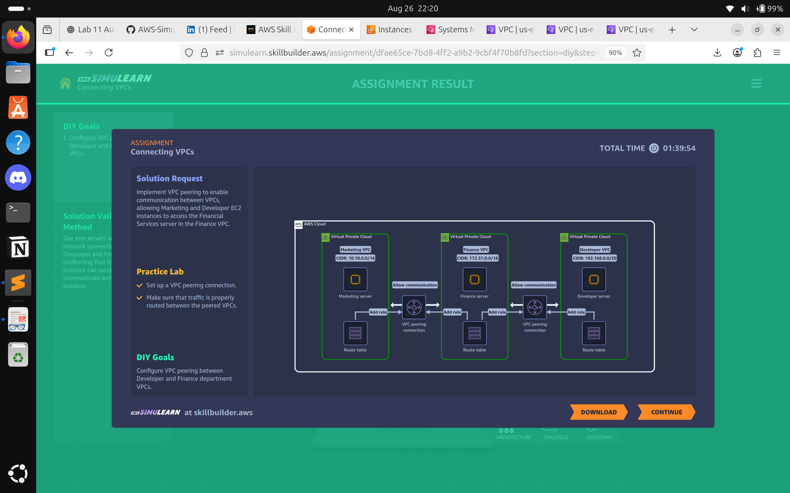

# Lab 12: Connecting VPCs
## Problem Statement  

**Ben Hertz – CMO**  

We created separate VPCs for Marketing, Development, and Finance to keep our applications secure and isolated. The problem is, every department needs to access financial reports from the Finance VPC. Currently, Marketing and Development staff must submit support tickets just to view Finance reports, which is slowing down business processes.  

We need a secure and efficient method to allow cross-department access to financial data without compromising isolation.  

---

## Solution Approach  

To address the problem, we implemented **VPC Peering** between Marketing and Finance networks:  

1. **Create VPC Peering Connection**  
   - Establish a peering connection between Marketing and Finance VPCs.  
   - Ensure peering is approved from both VPC sides.  

2. **Update Route Tables**  
   - Modify route tables in both VPCs to allow traffic to traverse the peering connection.  
   - Enable secure routing without exposing the VPC to the internet.  

3. **Security Groups and Network ACLs**  
   - Adjust security groups to permit required traffic between VPCs.  
   - Apply the principle of least privilege: only allow access to financial reports.  

4. **Testing and Validation**  
   - Verify connectivity by accessing financial resources from the Marketing VPC.  
   - Confirm that no other unauthorized resources are accessible.  

5. **Architecture Diagram**  
     

6. **Outcome**  
   - Marketing and Development staff can securely access Finance reports without support tickets.  
   - Maintains VPC isolation for other resources.  
   - Reduces operational delays and improves workflow efficiency.  

**AWS Services Used:** Amazon VPC, VPC Peering, Security Groups, Route Tables.  

---

## ISO 27001:2022 Control–Risk Mapping (Using Only Services in Solution)  

| ISO 27001 Control | Risk Mitigated in the Scenario | AWS Feature from Solution |  
|-------------------|--------------------------------|---------------------------|  
| A.5.14 – Physical and environmental security responsibilities | Mismanagement of VPC connectivity and isolation | Clear roles for managing VPC peering and route tables |  
| A.8.6 – Technical vulnerability management | Unauthorized access to financial resources | Security groups and route table restrictions |  
| A.8.8 – Exchange of information security responsibilities | Misunderstanding of cloud responsibilities | Shared responsibility awareness: AWS manages infrastructure, user manages network configuration |  
| A.8.14 – Logging and monitoring | Lack of visibility into cross-VPC access | VPC Flow Logs can monitor traffic between Marketing and Finance VPCs |  
| A.8.22 – Segregation in networks | Cross-department access without compromising security | VPC Peering allows controlled access while maintaining isolation |  

---

## Evidence & Files  

- Screenshot(s) in `evidence/lab12/` showing:  
  - VPC Peering connection creation and status.  
  - Route table updates for Marketing and Finance VPCs.  
  - Security group adjustments permitting necessary traffic.  
  - Architecture diagram illustrating VPC Peering connection.  

---

## Lessons Learned & Notes  

### Controlled Cross-VPC Access  
- VPC Peering allows departments to share resources securely without opening unnecessary access.  

### Principle of Least Privilege  
- Only traffic required for accessing Finance reports is allowed.  

### Shared Responsibility Awareness  
- AWS manages the underlying network infrastructure; the user is responsible for configuration and access controls.  

### Monitoring and Logging  
- VPC Flow Logs provide insight into traffic for auditing and troubleshooting purposes.  

---

## Future Improvements  

1. **Enable PrivateLink for Sensitive Services**  
   - Further isolates access to critical financial services.  

2. **Automate Access Approvals**  
   - Use Lambda functions or AWS Service Catalog to streamline network access requests.  

3. **Integrate CloudWatch Alarms**  
   - Detect unusual access patterns or misconfigurations in real-time.  

4. **Periodic Access Reviews**  
   - Ensure only necessary departments maintain VPC connectivity over time.  

5. **Expand Secure Access for Development VPC**  
   - Apply the same controlled approach to Development staff for other approved Finance resources.  
